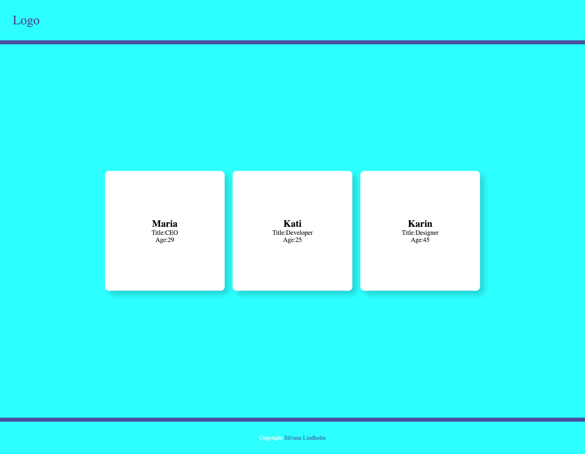

# React + Vite

# Team Cards App 🧑‍💼💻


## Overview

A simple **React** application that displays **team member cards** with their name, title, and age.  
It demonstrates component-based architecture, props usage, and Flexbox layout for responsive card arrangement.



## Features

- Display team members in styled cards
- Reusable `Card` component
- Responsive layout using **Flexbox**
- Simple header and footer design

## Tech Stack

- **React** – Component-based frontend framework
- **JavaScript (ES6)** – Logic and props handling
- **CSS3** – Flexbox layout, styling, shadows, and colors
- **HTML (JSX)** – Structure of components

## Project Structure

├── public/
│ └── index.html
├── src/
│ ├── Components/
│ │ └── Card.jsx
│ ├── App.css
│ └── App.jsx
├── package.json
└── README.md

## Usage

1. Clone the repository:
   ```bash
   git clone <repository-https://github.com/1967cooder/demo-basics>
   ```
2. Navigate to the project folder:

   cd team-cards-app

3. Install dependencies:

   npm install

4. Start the development server:

npm start

5. Open http://localhost:3000
   to see the app in action.

Example Component
<Card name="Maria" title="CEO" age="29" />
<Card name="Kati" title="Developer" age="25" />
<Card name="Karin" title="Designer" age="45" />

## Styles

Cards have a fixed 300x300px size, rounded corners, and subtle shadows.

Container uses Flexbox with wrapping for responsive layout.

Header and footer are centered using Flexbox.

Color scheme:

Aqua background for container and header

White cards with black text

Footer text styled to match header

## Links

- [Git Hub](https://github.com/1967cooder/demo-basics)

## Author

Silvana Lindholm

## Contact

Portfolio: [Live Demo](https://portfoliosilvana.netlify.app/)

GitHub [1967cooder](https://github.com/1967cooder/)

LinkedIn: https://www.linkedin.com/in/silvanalindholm

Email: silvanalindholm@hotmail.com
# demo-basics
