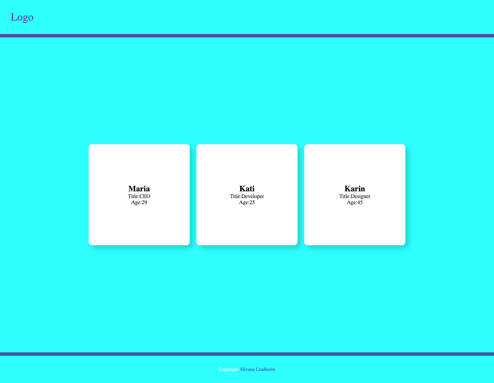
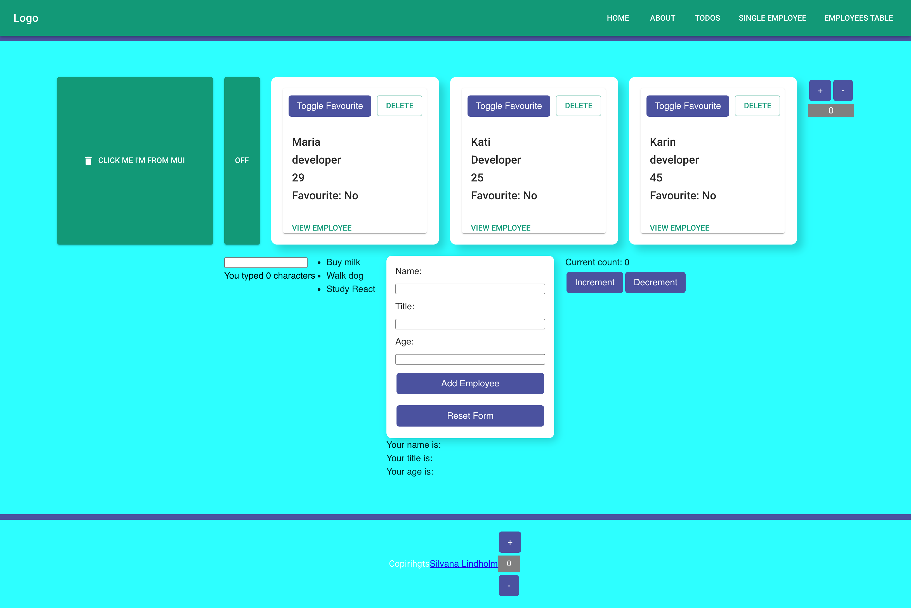
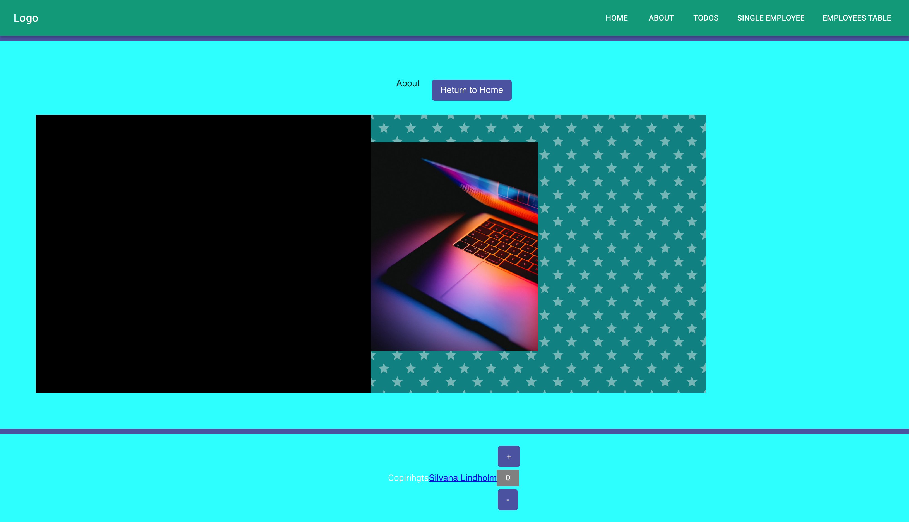
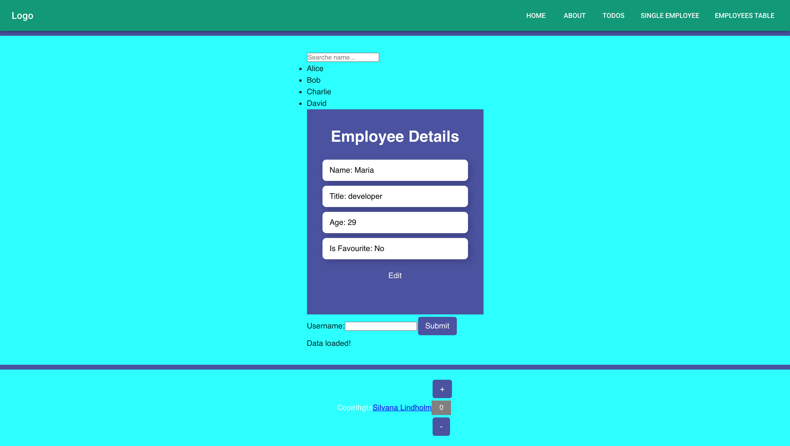
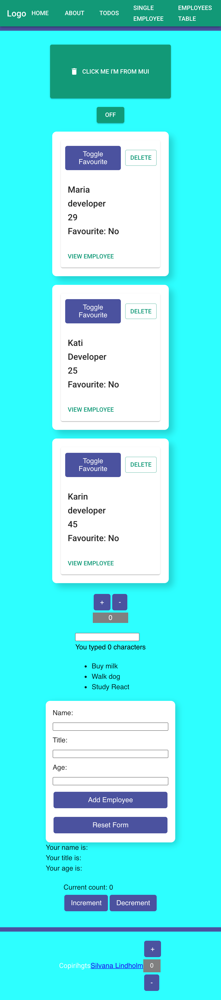

# React + Vite

# Team Cards App 🧑‍💼💻


## Overview

**Team Cards App** is a simple React application built with **Vite** that displays team members as cards.  
Each card shows a team member’s **name, job title, and age**.

The project is designed for learning purposes and demonstrates:

- React component-based architecture
- Props usage
- Basic routing/pages concept
- Responsive layouts using Flexbox







## Features

- Team members displayed in clean, modern cards
- Reusable `Card` component
- Responsive layout using **CSS Flexbox**
- Simple navigation between pages
- Header and footer layout
- Beginner-friendly React structure

## Tech Stack

- **React** – Component-based UI library
- **Vite** – Fast development and build tool
- **JavaScript (ES6)** – Logic, props, and components
- **CSS3** – Flexbox layout, styling, shadows, and colors
- **HTML (JSX)** – Structure of components

## Project Structure

demo-basics/
├── public/
│ ├── home.png
│ ├── about.png
│ ├── single_employee.png
│ └── index.html
├── src/
│ ├── Components/
│ │ └── Card.jsx
│ ├── App.css
│ ├── App.jsx
│ └── main.jsx
├── package.json
├── vite.config.js
└── README.md

## Usage

1. Clone the repository:
   ```bash
   git clone <repository-https://github.com/1967cooder/demo-basics>
   ```
2. Navigate to the project folder:

```bash
  cd demo-basics
```

3. Install dependencies:

```bash
   npm install
```

4. Start the development server:

```bash
npm run server
```

5. Open in browser

```bash
npm run dev
```

http://localhost:5173
to see the app in action.

Example Component
<Card name="Maria" title="CEO" age="29" />
<Card name="Kati" title="Developer" age="25" />
<Card name="Karin" title="Designer" age="45" />

## Styles

Cards have a fixed 300x300px size, rounded corners, and subtle shadows.

Container uses Flexbox with wrapping for responsive layout.

Header and footer are centered using Flexbox.

Color scheme:

Aqua background for container and header

White cards with black text

Footer text styled

## Learning Goals

This project helps practice:

- React components and props

- JSX syntax

- Component reusability

- Project structure with Vite

- Basic UI layout and styling

## Links

- [Git Hub](https://github.com/1967cooder/demo-basics)

## Author

Silvana Lindholm

## Contact

Portfolio1: [Live Demo1](https://portfoliosilvana.netlify.app/)
Portfolio2: [Live Demo2](https://portfolio-react-silvana.netlify.app/)

GitHub [1967cooder](https://github.com/1967cooder/)

LinkedIn: https://www.linkedin.com/in/silvanalindholm

Email: silvanalindholm@hotmail.com

# demo-basics
